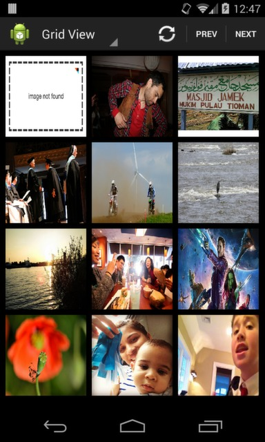
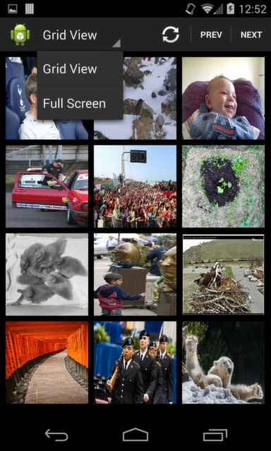
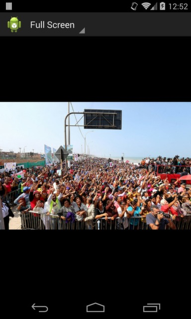

Photo browser
Your app calls a flickr API to get recent photos and show them one by one when swiping right to left. You will need to get developer keys from flickr for this.

http://api.flickr.com/services/rest/?method=flickr.photos.getrecent

SCREENSHOTS : 

